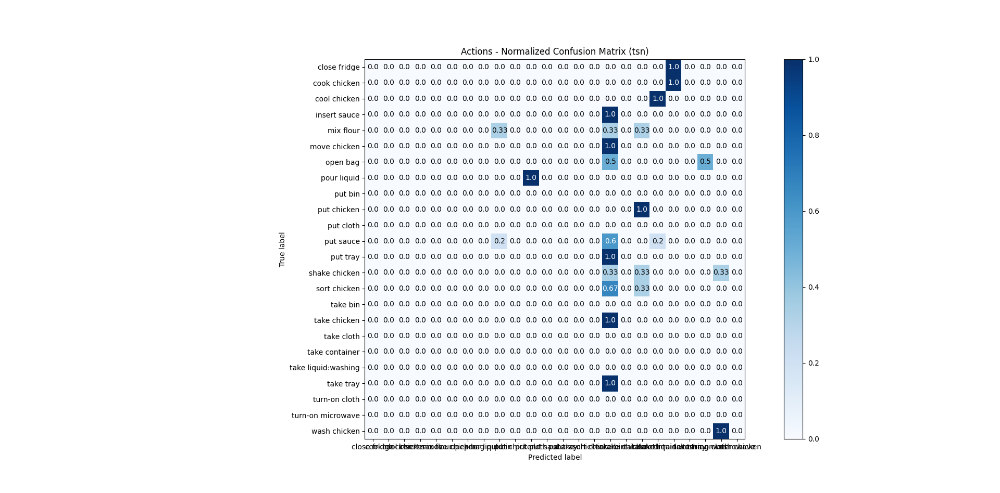

## Task A: Action Recognition (Alejandro Rodriguez Ramos)

- _Get familiar with the epic kitchen project: [https://epic-kitchens.github.io/2020-100](https://epic-kitchens.github.io/2020-100)_
- _Collect a couple of KFC kitchen videos from youtube as a dataset to perform the task._
  - The selected videos have been [one](https://www.youtube.com/watch?v=ZUr3DxYyTqI&t), [two](https://www.youtube.com/watch?v=c-uBjf988yE&t) and [three](https://www.youtube.com/watch?v=wiAYDb73Dbo&t). They do not provide ego-motion as in the epic kitchens dataset.
- _Go through the GitHub link: https://github.com/epic-kitchens/epic-kitchens-55-action-models and make use of two pre-trained models of your choice for running inference on your videos._
  - The selected models have been Temporal Segments Network (TSN) and Temporal Relation Network (TRN).
- _Run the models and report the approach used and model performance (most important step). In this step, we would like to see how you’d compare the models in terms of accuracy, losses, and FPS._
  - The results have been reported in the remainder of the page.

_Feel free to use any sort of visualisation library to better communicate your results. Plot to impress! :)_
_(optional) explain how you would optimise the model to run on an edge system._
  
### Environment and approach

  ```
  conda version : 4.9.1
  python version : 3.8.5.final.0
  torch: 1.5.0
  platform : linux-64
  OS: Ubuntu 18.04 Bionic Beaver
  GPU: GeForce GTX 950M (VRAM: 2GB)
  ```
  - Every video has been splitted into segments of 8 seconds each and resampled to constant 30 FPS (using this `ffmpeg`)
  - 30 random segments have been selected. These segments have been annotated in order to provide requested metrics (_e.g._ accuracy). 
  - The models have been executed in their RGB version.
  - The selected backbone has been _Resnet 50_.
  - Models are evaluated using 10 crops (center and corner crops as well as their horizontal flips) for each clip. The scores from these are averaged pre-softmax to produce a single clip-level score (as reported in [epic kitchen evaluation paper](https://arxiv.org/pdf/1908.00867.pdf)).
  - Each segment is divided into 8 snippets of 1 frame each.
  - Batch size has been set to 1.
  - Frames were loaded directly from video, using `ffmpeg` to extract snippet's frames.
  - The script used to generate results was `test_models.py` and to generate metrics was `generate_metrics.py`.
  
### Collected dataset
  
  Histogram of classes for verbs, nouns and actions in the collected dataset. For better visualization, please open images in a new tab.
  
  | Verbs | Nouns | Actions |
| --- | --- | --- |
|   |   |  |
  
### Losses
  
  The losses have been generated by applying a multi-class cross entropy function to both nouns and verbs raw network outputs. Then, both resulting losses have been added.
  
| TSN | TRN |
| --- | --- |
|  |  |

### Confusion matrices

 For better visualization, please open images in a new tab.

| TSN (Verbs) | TRN (Verbs) |
| --- | --- |
|   |   |

| TSN (Nouns) | TRN (Nouns) |
| --- | --- |
|   |   |

| TSN (Actions) | TRN (Actions) |
| --- | --- |
|   |   |

### Accuracy, precision and recall

| Model | Top-1 Accuracy (Verbs) | Avg. Class Precision (Verbs) | Avg. Class Recall (Verbs) |
| --- | --- | --- | --- |
| TSN (RGB) | 13% | 8.8% | 13.3% |
| TRN (RGB) | 6% | 3.7% | 6.6% |


| Model | Top-1 Accuracy (Nouns) | Avg. Class Precision (Nouns) | Avg. Class Recall (Nouns) |
| --- | --- | --- | --- |
| TSN (RGB) | 0.0% | 0.0% | 0.0% |
| TRN (RGB) | 0.0% | 0.0% | 0.0% |


| Model | Top-1 Accuracy (Actions) | Avg. Class Precision (Actions) | Avg. Class Recall (Actions) |
| --- | --- | --- | --- |
| TSN (RGB) | 0.0% | 0.0% | 0.0% |
| TRN (RGB) | 0.0% | 0.0% | 0.0% |

### Latency and FPS

The data loading latency accounts for the time it takes to load a video segment from disk, separate it into images with `ffmpeg`, and apply transforms. The inference latency accounts for the time it takes to make a forward pass of the model. The FPS metric has been calculated as `no. of frames per segment / full_latency` and `full_latency` accounts for the sum of the stated latencies provided.

| Model | Avg. Data Loading Latency (s) | Avg. Model Inference Latency (s) | Avg. FPS |
| --- | --- | --- | --- |
| TSN (RGB) | 0.548 | 1.879 | 3.29 |
| TRN (RGB) | 1.19 | 1.88 | 2.60 |

Note: times have been measured with `time` library. For more precising time profiling, pytorch profiler can be used instead.

### Preliminary explanation of performance results

The performance of both models has been notably poor. As a preliminary explanation, it can be due to:
- The annotation of the dataset has been too specific, _i.e._ "insert chicken" instead of "put meat". More experience in the annotation of this type of datasets is required.
- The models are trained in completely different domains. The video images of the original training/testing dataset had better quality and the video images were taken from the action-taking perspective (ego-motion). In the collected dataset, the video images lacked a bit of quality and were recorded from an external oberserver point of view.
- The selected model architecture (_e.g_ design (TSN, TRN, TSM, MTRN, etc.), backbone size, input (RGB, Flow, etc.), number of snippets per segment, etc.).

### Quick ideas to improve performance results
- Fine tune the models in the collected dataset domain.
- Forward pass of flow images too.
- Test BNInception backbone.
- Search for other optimum segment size and time between snippets.

### Optimization ideas for running on an edge system [optional]

Edge systems are normally computationally constrained. These are some ideas to improve the perfonmance of the model in terms of latency (without losing accuracy):
- Data loading (batch generation) and inference processing have to be decoupled (parallelized).
- Take advantage of the specific architecture  (_e.g._ tensor cores, etc.).
- Increase the batch size when possible.
- The model can be serialized and migrated to C++ (PyTorch C++ API).
- The model can be exported to ONNX in order to be  migrated to TensorRT.
- The model [can be pruned](https://pytorch.org/tutorials/intermediate/pruning_tutorial.html).
- Training in half or [mixed precision](https://pytorch.org/blog/accelerating-training-on-nvidia-gpus-with-pytorch-automatic-mixed-precision/).
- The model can be [quantized](https://pytorch.org/docs/stable/quantization.html). 
