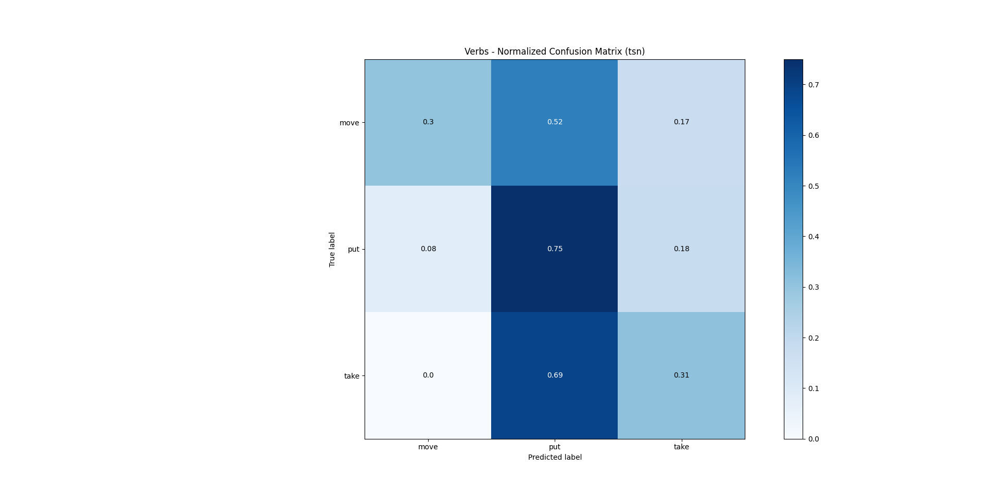

## Task B: Action Recognition (Alejandro Rodriguez Ramos)

_Use ffmpeg to split the videos you’ve collected into 8 second segments and label them by putting them into folders with label names (put, take, move)._

  -  The selected videos have been [one](https://www.youtube.com/watch?v=ZUr3DxYyTqI&t), [two](https://www.youtube.com/watch?v=c-uBjf988yE&t) and [three](https://www.youtube.com/watch?v=wiAYDb73Dbo&t). They do not provide ego-motion as in the epic kitchens dataset.
  - Every video has been splitted into segments of 8 seconds each and resampled to constant 30 FPS (using `ffmpeg`).
  - Each segment is divided into 8 snippets of 1 frame each for both training and validation.
  - The dataset has been annotated with verbs "put, take, move" and nouns "meat, bag, sauce, potato, tortilla". It is available [here](https://upm365-my.sharepoint.com/:u:/g/personal/alejandro_rramos_alumnos_upm_es/EXBXPixxHlRKvTmXoOsp7gUBuOhIWmlKIejCB51FputDwg?e=uFLXyI) and it is built on 102 videos segments of 8 seconds each (79 for training and 23 for validation).
  
  The format of the train/val annotations was included in a single `.csv` file as:
  
  ```
  uid,verb,noun,action,verb_class,noun_class
  ```
  The test dataset has been excluded from this study due to the reduced size of the full dataset.

_Next, split the folders into test and train sets._

1. _Transfer learn on one of the models above and report accuracy and loss on train_val test_val sets. Report the hardware you use for this task as well._
  
  - The training/testing pipeline has been implemented in [pytorch-lightning](https://pytorch-lightning.readthedocs.io/en/stable/) and TSN architecture has been selected for fine tuning/transfer learning.  

2. _Run inference on the videos from Task1 (exclude ones you used for training) and compare the difference between epic-kitchen models and your own trained model!_
3. _(optional) how would you improve accuracy and loss?_
4. _(optional) how would you incorporate speech data?_

_*Using GitHub commits for performing tasks above is a big plus._

### Environment and approach

  ```
  conda version : 4.9.1
  python version : 3.8.5.final.0
  pytorch_lightning: 1.0.5
  torch: 1.5.0
  platform : linux-64
  OS: Ubuntu 18.04 Bionic Beaver
  GPU: GeForce GTX 950M (VRAM: 2GB)
  ```
 
  - The models have been executed in their RGB version.
  - The selected backbone has been _Resnet 50_.
  - For training 1 crop is used.
  - Models are validated using 10 crops (center and corner crops as well as their horizontal flips) for each clip. The scores from these are averaged pre-softmax to produce a single clip-level score (as reported in [epic kitchen evaluation paper](https://arxiv.org/pdf/1908.00867.pdf)).
  - Batch size has been set to 1 for training and validation.
  - The frames from train/val datasets were preloaded in RAM directly from video, using `ffmpeg` to extract snippet's frames. This is possible due to the reduced size of the datasets.
  - The script used to train was `train_pl_model.py`, to generate the validation results was `test_pl_model.py` and to generate the metrics was `generate_metrics.py`.
  - The training evaluation was carried out with [tensorboard](https://www.tensorflow.org/tensorboard?hl=es-419) integration.
  
### Collected dataset
  
  Histogram of classes for verbs, nouns and actions in the collected dataset. For better visualization, please open images in a new tab.
  
  | Verbs (Train) | Nouns (Train) | Actions (Train) |
| --- | --- | --- |
|   |   |  |

  | Verbs (Val) | Nouns (Val) | Actions (Val) |
| --- | --- | --- |
|   |   |  |

Note: since datasets were splitted based on a random process, there are some noun classes in the validation dataset that are not present in the training dataset. For a better approach, this fact shall be solved.

### Losses

The presented losses have been used for evaluation of the training performance. 
  
  - The losses have been generated by applying a multi-class cross entropy function to both nouns and verbs raw network outputs. 
  - The selected optimizer was Adam with learning rate `1e-5`.
  - The whole network (included the backbone) has been trained during fine tuning (transfer learning).
  - The [checkpoint](https://upm365-my.sharepoint.com/:u:/g/personal/alejandro_rramos_alumnos_upm_es/EZInsnPNw29Osz8srGwCFF4B7QKUtoghGjUAxDS3o7awKw?e=jM79C3) corresponding to the epoch of minimum validation loss has been automatically selected for further evaluation.
  
| Training loss | Validation loss |
| --- | --- |
|  |  |

### Confusion matrices (Training)

 For better visualization, please open images in a new tab.

| TSN - Transfer Learning (Verbs) | TSN - Transfer Learning (Nouns) | TSN - Transfer Learning (Actions) |
| --- | --- | --- |
|   |   |  |

### Confusion matrices (Validation)

 For better visualization, please open images in a new tab.

| TSN - Baseline (Verbs) | TSN - Transfer Learning (Verbs) |
| --- | --- |
|   |   |

| TSN - Baseline (Nouns) | TSN - Transfer Learning (Nouns) |
| --- | --- |
|   |   |

| TSN - Baseline (Actions) | TSN - Transfer Learning (Actions) |
| --- | --- |
|   |   |

### Accuracy, precision and recall (Validation)

| Model | Top-1 Accuracy (Verbs) | Avg. Class Precision (Verbs) | Avg. Class Recall (Verbs) |
| --- | --- | --- | --- |
| TSN - Baseline (RGB) | 13.04% | 5.59% | 13.04% |
| TSN - Transfer Learning (RGB) | 47.47% | 42.45% | 47.82% |


| Model | Top-1 Accuracy (Nouns) | Avg. Class Precision (Nouns) | Avg. Class Recall (Nouns) |
| --- | --- | --- | --- |
| TSN - Baseline (RGB) | 0.0% | 0.0% | 0.0% |
| TSN - Transfer Learning (RGB) | 47.82% | 49.86% | 47.79% |


| Model | Top-1 Accuracy (Actions) | Avg. Class Precision (Actions) | Avg. Class Recall (Actions) |
| --- | --- | --- | --- |
| TSN - Baseline (RGB) | 0.0% | 0.0% | 0.0% |
| TSN - Transfer Learning (RGB) | 30.43% | 18.72% | 30.41% |


### Latency and FPS

The data loading latency accounts for the time it takes to retrieve an item from the dataset class instance. The inference latency accounts for the time it takes to make a forward pass of the model. The FPS metric has been calculated as `no. of frames per segment / full_latency` and `full_latency` accounts for the sum of the stated latencies provided.

| Model | Avg. Data Loading Latency (s) | Avg. Model Inference Latency (s) | Avg. FPS |
| --- | --- | --- | --- |
| TSN - Transfer Learning (RGB) | 0.018 | 1.84 | 4.28 |

Note: times have been measured with `time` library. For more precise time profiling, pytorch profiler can be used instead.


### Preliminary explanation of performance results

The performance of baseline model has been poor while the performance of the fine tuned model has improved notably. The accuracy metric is within an acceptable range, regarding the scope of this task, and precision and recall metrics are balanced (they can be higher but denote precision and robutness against false positives). Nevertheless, several optimizations of hyperparameters, dataset size and quality, and model architecture can be carried out.

### How would you improve accuracy and loss? [optional]

- Increase the dataset size, quality of the images and assure a representative dataset domain. Assure the actions in the dataset are well delimited (videos smartly splitted).
- Include the _test_ dataset for a formal evaluation of the perfomance in a non-optimized set.
- Perform a long training in order to check in _double descent_ is present.
- Forward pass of Flow images, RGB diff, etc.
- Test BNInception backbone.
- Try freezing backbone and fine tuning last layers.
- Search for other optimum segment size and time between snippets.
- Grid search on learning rate, learning rate scheduler, etc.
- Test other architectures.

### How would you incorporate speech data? [optional]

- A recurrent architecture, such as an LSTM, can be used as a feature extractor for speech data. The features can be inputed in the last fully connected layers.
- A [spectogram](https://en.wikipedia.org/wiki/Spectrogram) can be generated from speech data in order to include it as another channel to the CNN layers input.
- [Temporal Convolutional Networks (TCNs)](https://medium.com/@raushan2807/temporal-convolutional-networks-bfea16e6d7d2) can be integrated into the presented architectures in order to account for the temporal structure of speech data (in combination of other techniques).
